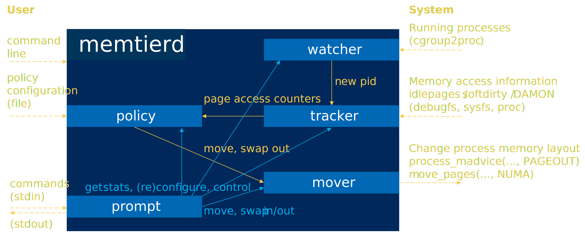

# Memtierd

Memtierd is a daemon and command line utility for tracking, moving and
swapping memory on Linux.

When running as a daemon, memtierd finds relevant processes from the
system and cgroups, tracks accesses to their memory regions, moves
data to different NUMA nodes or swaps it out, based on last access
times or access frequency.

[]

When running in interactive prompt, available commands control
trackers and policies, show statistics on performance, last access
times and memory heat classification. Furthermore, commands enable
immediate memory moves, and swapping data out and back into RAM.

## Build

```
make
```

See `make help` for options and targets.
